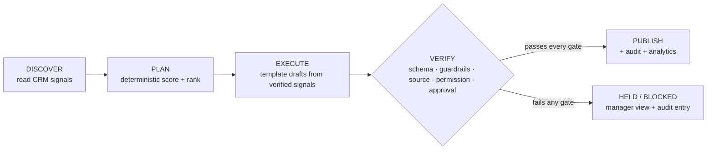
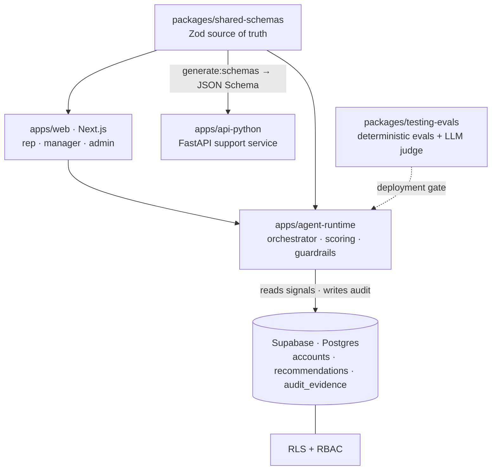

<div align="center">

# AI Account Prioritization Agent

**Turn messy B2B CRM data into a _verified daily sales action plan_** — which accounts to contact first, **why** they matter, **what** to do next, the **evidence** behind it, and proof it passed every safety, schema, permission, and eval gate.

[](https://github.com/Lvvphole/ai-account-prioritization/actions/workflows/ci.yml)


</div>

> **The LLM never ranks accounts.** Deterministic scoring decides priority,
> runtime guardrails are synchronous and deterministic, the LLM-as-a-judge runs
> only in evals, and nothing customer-facing is sent without **human approval**.

---

## Overview

B2B reps waste prime selling hours deciding *who* to contact, and most "AI" tools
hallucinate facts, can't show their work, and act without guardrails — so reps
don't trust them. This product is a **daily agent** that, for every account a rep
should act on, answers five questions with receipts:

| # | Question | Answer |
| - | -------- | ------ |
| 1 | **Which** to contact first? | A deterministic rank (pure scoring, reproducible) |
| 2 | **Why** does it matter? | Closed-set **reason codes** + a templated narrative |
| 3 | **What** to do next? | A concrete **next best action** |
| 4 | **What evidence** supports it? | **Verified source signals** (no fabrication) |
| 5 | Is it **safe to publish**? | Pass/fail across schema, guardrail, source, and permission gates |

Every recommendation carries **score, confidence, reason codes, verified source
signals, and a next best action** — and only publishes after passing every gate.
Anything that fails, fails **closed** and surfaces (with the failing gate) in the
manager view, with an audit entry written.

## Table of contents

- [Why it exists](#why-it-exists)
- [Key features](#key-features)
- [How it works](#how-it-works)
- [Who uses it](#who-uses-it)
- [Architecture](#architecture)
- [Tech stack](#tech-stack)
- [Getting started](#getting-started)
- [Configuration](#configuration)
- [Command reference](#command-reference)
- [Testing & evaluations](#testing--evaluations)
- [Data & security](#data--security)
- [Deployment](#deployment)
- [Project structure](#project-structure)
- [Roadmap & status](#roadmap--status)
- [Contributing](#contributing)
- [Docs](#docs)
- [License](#license)

## Why it exists

**Problem.** Reps drown in noisy CRM/account data and burn their best hours
deciding who to call. Generic AI assistants invent facts, can't justify their
output, and take actions no one approved.

**Product.** A trustworthy daily plan built on a hard separation: a
**deterministic core** makes every ranking and safety decision, while the LLM is
confined to *generation* (narration, drafts) behind guardrails and to *evaluation*
(an offline judge). Nothing reaches a customer or the CRM without a human.

## Key features

- **Deterministic ranking** — a pure weighted sum of account features with a
  stable tie-break; the same inputs produce a byte-for-byte identical run.
- **Explainable by construction** — closed-set reason codes plus a narrative
  *templated* from verified signals, so it cannot contain fabricated claims.
- **Next best action** — one concrete, accountable action per recommendation.
- **Verified source signals** — only verifiable evidence may be cited; unverified
  signals fail the gate.
- **Fail-closed gates** — invalid schema, unverified signal, unsupported claim,
  missing approval, or sub-floor confidence ⇒ *not published*, surfaced as
  held/blocked.
- **Human-in-the-loop** — customer-facing sends and CRM write-back require
  explicit approval; the approval gate cannot be silently disabled.
- **Immutable audit trail** — every critical action writes `audit_evidence`.
- **RBAC + Row Level Security** — `rep` / `manager` / `admin` roles enforced in
  Postgres via Supabase RLS.
- **Eval-gated** — deterministic evals (scoring, guardrails, security, golden
  run) plus an async LLM-as-a-judge that is *deployment-blocking* when enabled.
- **Schema as contract** — TypeScript/Zod is the single source of truth and
  generates JSON Schema the Python service consumes (it never imports TS).
- **MCP-compatible tool registry** — read-only runtime tools are registered;
  side-effecting tools stay approval-gated.

## How it works

The runtime is one synchronous, deterministic loop — **no model call lives in
it**:



**Two paths, kept separate:**

- **Runtime path** (synchronous, deterministic): `orchestrator → Zod state
  validation → deterministic scoring → deterministic guardrails →
  permission/approval gate → audit log → analytics → publish`.
- **Evaluation path** (asynchronous, outside the runtime): deterministic evals +
  an LLM-as-a-judge that degrades to a deterministic heuristic offline and
  becomes a **deployment-blocking** gate when `EVAL_JUDGE_ENABLED=true`.

**Determinism guarantees:** scoring is a pure weighted sum of features
(`apps/agent-runtime/src/config/runtime.ts`); ranking is score-desc with a stable
`accountId` tie-break; the narrative is template-built (no free-form model text in
the runtime path); the same inputs are reproducible — asserted by the golden eval.

## Who uses it

| Persona | Route(s) | What they get |
| ------- | -------- | ------------- |
| **Rep** | `/dashboard`, `/accounts/[accountId]` | A ranked priority list with reason codes, evidence, and the next best action; approves customer-facing actions |
| **Manager** | `/manager` | Coverage gaps and recommendations held by the safety gates (with failing gate) |
| **Admin** | `/admin/scoring` | Inspects the deterministic scoring configuration |
| Landing | `/` | Entry point / overview |

## Architecture

A **Turborepo** monorepo using a co-located agent-module pattern: a deterministic
core, guarded LLM generation, a shared-schema contract, and eval-gated CI/CD.



> The Python service is a **support** service — it never ranks accounts or
> controls the runtime, and it consumes generated JSON Schema only.

## Tech stack

| Layer | Technology |
| ----- | ---------- |
| Monorepo / tasks | Turborepo, pnpm workspaces |
| Runtime & schemas | TypeScript (strict), Zod |
| Web | Next.js 15 (App Router), React |
| Database / auth | Supabase (Postgres, RLS, Auth) |
| Support service | Python, FastAPI |
| Testing & evals | Vitest, LLM-as-a-judge |
| Packaging / deploy | Docker + Compose, Vercel (web) |

## Getting started

### Prerequisites

- **Node** `>= 20` and **pnpm** `10.33` (`packageManager` is pinned)
- **Docker** (optional — for the containerized stack)
- **Supabase CLI** (optional — for local DB / migrations / type generation)

> The deterministic core runs with **none** of the optional integrations: absent
> credentials degrade to an in-memory store so the loop is always runnable.

### Install & run

```bash
pnpm install
pnpm generate:schemas      # Zod -> JSON Schema (also feeds the Python service)
pnpm build                 # turbo build (schemas, runtime, web, python)
pnpm typecheck             # turbo typecheck
pnpm test:evals            # deterministic eval gates

# See a deterministic run end-to-end:
pnpm --filter agent-runtime dev

# Run the web app:
pnpm --filter web dev

# Async LLM-as-a-judge (uses ANTHROPIC_API_KEY when set; deterministic heuristic otherwise):
EVAL_JUDGE_ENABLED=true pnpm test:judge
```

## Configuration

Copy `.env.example` to `.env` and fill in only what you need. **Never commit real
secrets.** The deterministic runtime requires none of these.

| Group | Variables | Purpose |
| ----- | --------- | ------- |
| Supabase | `NEXT_PUBLIC_SUPABASE_URL`, `NEXT_PUBLIC_SUPABASE_ANON_KEY`, `SUPABASE_URL`, `SUPABASE_ANON_KEY`, `SUPABASE_SERVICE_ROLE_KEY`, `SUPABASE_DB_URL` | Database, auth, RLS |
| Judge (LLM) | `EVAL_JUDGE_ENABLED` (default `false`), `ANTHROPIC_API_KEY`, `EVAL_JUDGE_MODEL` | Async LLM-as-a-judge (eval only, never ranking); without `ANTHROPIC_API_KEY` it stays on the deterministic heuristic |
| CRM | `CRM_BASE_URL`, `CRM_API_KEY` | External CRM source; absent ⇒ in-memory mock |
| Approval | `REQUIRE_HUMAN_APPROVAL` (default `true`) | Hard safety switch for customer-facing / CRM actions |
| Observability | `SENTRY_DSN`, `SENTRY_TRACES_SAMPLE_RATE`, `LANGFUSE_PUBLIC_KEY`, `LANGFUSE_SECRET_KEY`, `LANGFUSE_BASEURL` | Sentry errors + Langfuse tracing in the Python service (env-gated; install the `observability` extra) |

## Command reference

All commands run from the repo root.

| Command | Description |
| ------- | ----------- |
| `pnpm install` | Install workspace dependencies |
| `pnpm generate:schemas` | Generate JSON Schema from Zod (writes to shared-schemas + api-python) |
| `pnpm build` | Build everything via Turborepo |
| `pnpm typecheck` | Typecheck all packages |
| `pnpm lint` | Lint all packages |
| `pnpm test` | Run unit tests |
| `pnpm test:evals` | Run deterministic eval gates |
| `pnpm test:judge` | Run the async LLM-as-a-judge eval |
| `pnpm build:api-python` | Build the Python support service |
| `pnpm supabase:types` | Regenerate Supabase DB types (needs the Supabase CLI) |
| `pnpm db:lint` | Lint Supabase migrations (needs the Supabase CLI) |
| `pnpm check:no-prisma` | Guard: Prisma is intentionally excluded |
| `pnpm docker:config` | Validate the Compose file (no daemon required) |
| `pnpm docker:build` | Build all container images |
| `pnpm dev` | Run dev tasks |
| `pnpm clean` | Clean build artifacts |

## Testing & evaluations

- **Deterministic evals** (`packages/testing-evals`): scoring, guardrails,
  security (adversarial / prompt-injection), and a **golden run** that proves the
  orchestrator is byte-for-byte reproducible.
- **Security properties asserted:** prompt injection cannot change deterministic
  rank, fabricated claims never publish, unverified evidence fails closed, and
  customer-facing actions require approval.
- **LLM-as-a-judge** (`*.judge.eval.ts`): runs only via `pnpm test:judge`, stays
  out of the runtime path, and becomes **deployment-blocking** when
  `EVAL_JUDGE_ENABLED=true` (falls back to a deterministic heuristic with no key).

```bash
pnpm test:evals                              # deterministic gates
EVAL_JUDGE_ENABLED=true pnpm test:judge      # judge gate (heuristic offline)
```

## Data & security

Persistence, auth, and access control live in **Supabase / Postgres**, defined by
versioned migrations in `supabase/`:

| Migration | Contents |
| --------- | -------- |
| `0001_init_core_tables` | `pgcrypto`, enums (`app_role`, tiers, stages…), `set_updated_at` helper |
| `0002_auth_rbac_profiles` | `profiles` table + RBAC roles (`rep`/`manager`/`admin`) |
| `0003_accounts_contacts_opportunities` | CRM domain tables + activities |
| `0004_recommendations_audit_evidence` | Recommendations, immutable audit, eval results |
| `0005_rls_policies` | Row Level Security for every tenant/user-scoped table |
| `0006_observability_events` | Observability event sink |

- **RBAC + RLS** — reps see only their accounts; managers/admins are scoped by
  policy. Service-role access is confined to trusted server contexts.
- **Immutable audit** — `audit_evidence` records every critical decision;
  audit writes go through the service role (the trail has no client INSERT path).
- **Approval gates** — customer-facing sends and CRM write-back fail closed
  without explicit human approval.
- **No secrets in the repo** — `.env.example` and `supabase/seed.sql` contain
  local placeholders only.

## Deployment

- **Containers** — `infra/compose.yaml` builds three images
  (`Dockerfile.agent-runtime`, `Dockerfile.web`, `Dockerfile.api-python`):

  ```bash
  pnpm docker:config   # validate compose (no daemon needed)
  pnpm docker:build    # build all images
  ```

- **Web (Vercel)** — deploy `apps/web` with the project **Root Directory** set to
  `apps/web`.
- **Database (Supabase)** — apply `supabase/migrations` to your project; seed
  locally with `supabase/seed.sql`.
- **CI/CD** — GitHub Actions: `ci.yml` (build, typecheck, evals, no-prisma,
  Compose + image build), `evals.yml`, and `deploy.yml`.

## Project structure

```
apps/
  agent-runtime/   Deterministic orchestrator + scoring + guardrails (TypeScript)
  web/             Next.js UI: rep dashboard, account detail, manager, admin
  api-python/      Isolated FastAPI support service (consumes generated schemas)
packages/
  shared-schemas/  TypeScript/Zod source of truth + JSON Schema generation
  supabase-client/ Typed Supabase clients + generated DB types
  testing-evals/   Deterministic evals + async LLM-as-a-judge
  config-*/        Shared TypeScript / ESLint config
infra/             Docker Compose + per-service Dockerfiles
supabase/          Migrations, RLS policies, seed, config
scripts/           Build / verification helpers
docs/              PRD, ARCHITECTURE, CONTEXT
.github/workflows/ ci.yml, evals.yml, deploy.yml
```

## Roadmap & status

**Shipped:** deterministic agent runtime (scoring, guardrails, approval, audit),
Next.js web app (rep / manager / admin), Python support service, Zod
schema-as-contract + JSON Schema generation, deterministic evals + LLM judge,
Supabase database with RLS + RBAC + immutable audit, the Docker/Compose stack, a
dedicated security package (RBAC/approval/PII redaction), web sign-in via Supabase
Auth, Sentry/Langfuse observability in the Python service, and a shared
`@repo/observability` layer (PII-safe events + a deterministic eval).

**Planned:** CI/CD & security-workflow hardening (verification reports, security
and deploy workflows).

## Contributing

Read [`AGENTS.md`](./AGENTS.md) first — it is the operating contract (the
non-negotiable rules and the Strategic Programming workflow:
`contract → plan → execute → verify → evaluate → iterate → stop`).

Definition of Done (the gate sequence):

```bash
pnpm install
pnpm generate:schemas
pnpm build
pnpm typecheck
pnpm test:evals
```

Full production-contract check:

```bash
bash scripts/verify-production-contract.sh
```

The executor never self-certifies — the verifier owns completion. Never push
directly to `main`; open a PR.

## Docs

- [`AGENTS.md`](./AGENTS.md) — coding-agent operating contract (read first)
- [`docs/PRD.md`](./docs/PRD.md) — product requirements
- [`docs/ARCHITECTURE.md`](./docs/ARCHITECTURE.md) — system design
- [`docs/CONTEXT.md`](./docs/CONTEXT.md) — Scrum + Strategic Programming process

## License

MIT — see `package.json`.
