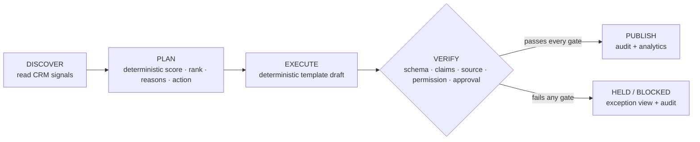
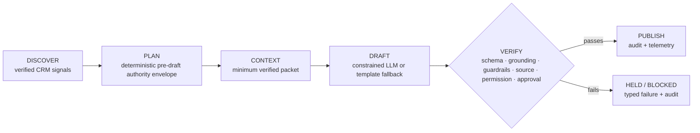
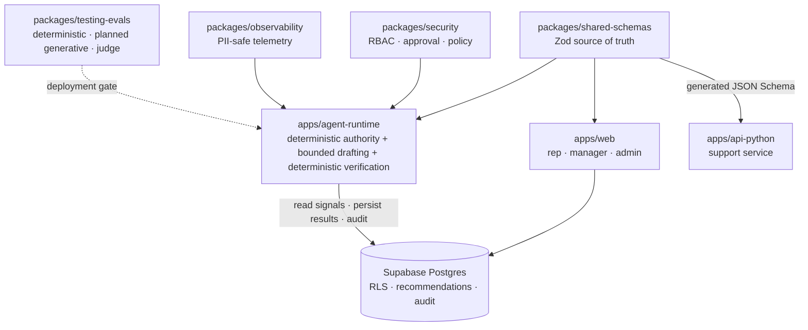

<div align="center">

# AI Account Prioritization Agent

**Turn CRM noise into a ranked daily action plan.** Every recommendation carries
its evidence, reason codes, action, draft provenance, and proof that it passed
every gate.

[](https://github.com/Lvvphole/ai-account-prioritization/actions/workflows/ci.yml)


</div>

> **The LLM never ranks accounts.** Deterministic TypeScript decides score,
> rank, reason codes, next-best-action type, permissions, and approval
> requirements. The approved hybrid architecture permits a constrained runtime
> LLM only for grounded signal synthesis and action drafting. A deterministic
> post-draft verifier and human approval decide publication.

---

## Overview

Reps burn selling hours deciding who to contact. Generic AI assistants can invent
facts, obscure their reasoning, and act without approval.

This product answers six questions with receipts:

| # | Question | Answer |
| - | -------- | ------ |
| 1 | Which account first? | Deterministic score and stable rank |
| 2 | Why does it matter? | Closed-set reason codes and verified evidence |
| 3 | What should I do? | Deterministically selected next-best action |
| 4 | How should I express it? | Grounded AI draft or deterministic template fallback |
| 5 | What backs every claim? | Verified source-signal references |
| 6 | Is it safe to publish? | Deterministic schema, grounding, guardrail, source, permission, and approval gates |

The architecture separates four boundaries:

- **Pre-draft deterministic authority:** decides who, why, action type,
  permissions, and approval requirements.
- **Bounded runtime generation:** may determine how a verified recommendation is
  expressed.
- **Post-draft deterministic verification:** decides whether the candidate may
  publish or must be held.
- **Asynchronous evaluation:** assesses quality and can block deployment, but
  cannot alter a live recommendation.

Anything that fails a gate fails closed, surfaces in the manager exception view,
and writes audit evidence.

## Current status

The deterministic baseline is implemented:

- deterministic scoring and stable ranking
- closed-set reason codes
- verified source signals
- deterministic template drafts
- synchronous guardrails
- human approval
- immutable audit and observability
- deterministic evals and asynchronous LLM judge

The hybrid architecture contract is now approved. The runtime LLM path is not yet
implemented. Until its schema, grounding, security, telemetry, and deployment
gates pass, the deterministic template path remains active.

The remaining implementation sequence is:

1. Connect runtime persistence to the web workspace.
2. Add the generated-draft Zod schema.
3. Add the bounded runtime model adapter.
4. Add minimum verified context construction.
5. Add claim-to-source grounding validation.
6. Preserve and test the deterministic template fallback.
7. Add generation evals and measured rollout controls.

## Key features

- **Deterministic ranking.** A pure weighted sum with a stable `accountId`
  tie-break. The same inputs produce the same pre-draft authority envelope.
- **Bounded AI drafting.** The target runtime model may synthesize verified
  signals and draft action content, but it cannot change authoritative fields.
- **Explainable by construction.** Closed-set reason codes and traceable source
  signals explain every priority decision.
- **Claim-level grounding.** Every accepted generated factual claim must map to
  verified source IDs.
- **Explicit fallback.** Model failure uses a configured deterministic template
  fallback or holds the recommendation. Silent provider switching is forbidden.
- **Honest measures.** Priority score, evidence confidence, and win probability
  remain separate concepts.
- **Fail-closed gates.** Invalid schema, unsupported claims, unverified evidence,
  grounding failure, missing approval, or sub-floor confidence block publication.
- **Human in the loop.** Customer-facing sends and CRM write-back require
  approval that cannot be silently disabled.
- **Immutable audit.** Critical decisions, model calls, fallbacks, publishes,
  blocks, and external writes create audit evidence.
- **RBAC and Row Level Security.** Access is enforced in Postgres, not only in
  the UI.
- **Eval-gated CI.** Deterministic and security gates protect deployment today.
  Runtime-generation schema, grounding, authority, injection, and fallback gates
  are planned and become deployment-blocking only after the hybrid runtime is
  implemented. The asynchronous judge remains separately policy-gated.
- **Schema as contract.** Zod is the source of truth and generates JSON Schema
  for the Python service.

## How it works

### Current deterministic runtime


```mermaid
flowchart LR
    A["DISCOVER<br/>read CRM signals"] --> B["PLAN<br/>deterministic score · rank · reasons · action"]
    B --> C["EXECUTE<br/>deterministic template draft"]
    C --> D{"VERIFY<br/>schema · claims · source · permission · approval"}
    D -- "passes every gate" --> E["PUBLISH<br/>audit + analytics"]
    D -- "fails any gate" --> F["HELD / BLOCKED<br/>exception view + audit"]
```

### Approved hybrid runtime


```mermaid
flowchart LR
    A["DISCOVER<br/>verified CRM signals"] --> B["PLAN<br/>deterministic pre-draft authority envelope"]
    B --> C["CONTEXT<br/>minimum verified packet"]
    C --> D["DRAFT<br/>constrained LLM or template fallback"]
    D --> E{"VERIFY<br/>schema · grounding · guardrails · source · permission · approval"}
    E -- "passes" --> F["PUBLISH<br/>audit + telemetry"]
    E -- "fails" --> G["HELD / BLOCKED<br/>typed failure + audit"]
```

The runtime model may only create candidate language. It has no tool authority,
no side effects, and no power to score, rank, select actions, approve, verify, or
publish. Different candidates may produce different deterministic gate results;
the verifier, not the model, owns those outcomes.

## Scoring

Six features are clamped to 0 to 1, scaled toward a saturation point, and
multiplied by their weight. Weights live in
`apps/agent-runtime/src/config/runtime.ts`.

| Feature | Weight | Scaling |
| ------- | ------ | ------- |
| Open pipeline | 25% | Linear to $250,000 |
| Verified intent | 20% | Linear to 3 signals |
| Contact staleness | 15% | Linear to 30 days |
| Account tier | 15% | Tier weight lookup |
| Lifecycle stage | 15% | Stage weight lookup |
| Health risk | 10% | `(100 - health) / 100` |

Ranking is score descending with a stable `accountId` tie-break. Reason-code
thresholds are separate from the weights. The score ranks attention needed, not
close likelihood.

## Interface layers

### Data

Accounts, contacts, opportunities, activities, intent, contracts, provenance,
outcomes, recommendations, audit evidence, and observability events.

### Customer workspace

| Persona | Routes | Purpose |
| ------- | ------ | ------- |
| Rep | `/dashboard`, `/accounts/[id]` | Ranked book, evidence, drafts, approvals, exports |
| Manager | `/manager` | Exception queue, coverage, revenue at risk, held items |
| Admin | `/admin` | Operations and governance control plane |
| Anyone | `/`, `/login` | Landing page and role sign-in |

The web workspace currently uses demonstration data. The production bridge to
persisted runtime recommendations remains required.

### Admin control plane

| Section | Purpose |
| ------- | ------- |
| `/admin` | Operational health and attention queue |
| `/admin/data` | Source health, freshness, rejects, lineage |
| `/admin/data/imports` | CSV import, scan, validation, change set, commit |
| `/admin/policy` | Deterministic scoring policy and simulation |
| `/admin/drafting` | Runtime model, prompt, schema, grounding, fallback |
| `/admin/evals` | Current deterministic/judge suites and planned generation suites |
| `/admin/guardrails` | Holds, failed rules, approval rules |
| `/admin/runs` | Run history and recommendation inspector |
| `/admin/users` | Capability matrix and account access |
| `/admin/audit` | Append-only trail and incidents |
| `/admin/environments` | Versions and promotion path |

Scoring policy and drafting policy remain separate because they have different
failure modes, metrics, and rollback paths.

## Architecture


```mermaid
flowchart TB
    W["apps/web<br/>rep · manager · admin"]
    R["apps/agent-runtime<br/>deterministic authority + bounded drafting + deterministic verification"]
    S["packages/shared-schemas<br/>Zod source of truth"]
    SEC["packages/security<br/>RBAC · approval · policy"]
    OBS["packages/observability<br/>PII-safe telemetry"]
    P["apps/api-python<br/>support service"]
    J["packages/testing-evals<br/>deterministic · planned generative · judge"]
    DB[("Supabase Postgres<br/>RLS · recommendations · audit")]

    W --> DB
    R -->|read signals · persist results · audit| DB
    S --> R
    S --> W
    S -->|generated JSON Schema| P
    SEC --> R
    OBS --> R
    J -. deployment gate .-> R
```

The Python service never ranks accounts or controls the runtime.

## Project structure

```text
apps/
  agent-runtime/   Hybrid runtime; deterministic authority and verification
  web/             Next.js rep, manager, account, and admin workspace
  api-python/      FastAPI support service
packages/
  shared-schemas/  Zod source of truth and JSON Schema generation
  supabase-client/ Typed Supabase clients and generated DB types
  security/        RBAC, approval, PII and security policy
  observability/   PII-safe event and telemetry layer
  testing-evals/   Deterministic, planned generative, and async judge evals
  config-*/        Shared TypeScript and ESLint configuration
infra/             Docker Compose and per-service Dockerfiles
supabase/          Migrations, RLS policies, seed, and config
scripts/           Build and verification helpers
docs/              PRD, architecture, context, and decision records
.github/workflows/ CI, eval, security, and deployment workflows
```

Target runtime-generation locations:

```text
apps/agent-runtime/src/
  inference/                               model adapter and provider boundary
  agents/sales-execution/
    execution.agent.ts                    drafting orchestration
    execution.prompt.ts                   versioned prompt contract
    execution.policy.ts                   model, budget, and fallback policy
    validate-draft-grounding.ts           claim-to-source verifier
    tools/                                deterministic template fallback
packages/shared-schemas/src/              generated-draft schema
packages/testing-evals/src/               drafting and grounding evals
```

## Configuration

Copy `.env.example` to `.env` and fill only what is needed. Never commit secrets.

| Group | Variables | Purpose |
| ----- | --------- | ------- |
| Supabase | `NEXT_PUBLIC_SUPABASE_URL`, `NEXT_PUBLIC_SUPABASE_ANON_KEY`, `SUPABASE_URL`, `SUPABASE_ANON_KEY`, `SUPABASE_SERVICE_ROLE_KEY`, `SUPABASE_DB_URL` | Database, auth, RLS |
| Judge | `EVAL_JUDGE_ENABLED`, `ANTHROPIC_API_KEY`, `EVAL_JUDGE_MODEL` | Async evaluation only |
| CRM | `CRM_BASE_URL`, `CRM_API_KEY` | External source; mock in non-production only |
| Approval | `REQUIRE_HUMAN_APPROVAL` | Hard safety switch |
| Observability | `SENTRY_*`, `LANGFUSE_*` | Error and trace sinks |

Runtime drafting variables will be added only when the model adapter is
implemented. Dead configuration is intentionally avoided.

## Commands

```bash
pnpm install --frozen-lockfile
pnpm generate:schemas
pnpm lint
pnpm build
pnpm typecheck
pnpm test
pnpm test:evals
pnpm verify:security
pnpm verify:observability
pnpm verify:production
```

Optional asynchronous judge:

```bash
EVAL_JUDGE_ENABLED=true pnpm test:judge
```

## Testing and evaluations

The current deterministic suites cover scoring, stable ranking, guardrails,
adversarial security, and a golden run.

The hybrid implementation must add and register deployment-blocking tests for:

- generated-output schema
- authoritative-field immutability
- claim-to-source grounding
- prompt-injection resistance
- model timeout and token budgets
- deterministic fallback
- approval and publication separation
- model and prompt provenance

These runtime-generation gates are planned, not currently shipped. The LLM judge
remains outside the runtime path.

## Data and security

Persistence, authentication, and access control live in Supabase migrations.

- Reps see only their accounts; managers and admins are policy-scoped.
- Service-role credentials remain server-only.
- `audit_evidence` is append-only for critical decisions and side effects.
- Customer-facing sends and CRM write-back fail closed without approval.
- CSV formula characters are neutralized before export.
- CRM and customer text are untrusted data, including inside prompts.
- The runtime drafter receives no general tool registry or side-effecting tools.
- Model-provider payloads must be authorized, minimized, and redacted.

## Deployment

- Validate containers with `pnpm docker:config`.
- Build images with `pnpm docker:build`.
- Deploy `apps/web` on Vercel with Root Directory `apps/web`.
- Apply `supabase/migrations` before production traffic.
- Use `ci.yml`, `evals.yml`, `security.yml`, and `deploy.yml` as promotion gates.
- Do not enable runtime LLM drafting until its implementation-specific gates pass.

## Contributing

Read [`AGENTS.md`](./AGENTS.md) first. It is the root operating contract.
Never push directly to `main`; work through a branch and reviewed change.

## Docs

- [`AGENTS.md`](./AGENTS.md) — operating contract
- [`docs/PRD.md`](./docs/PRD.md) — product requirements
- [`docs/ARCHITECTURE.md`](./docs/ARCHITECTURE.md) — system design
- [`docs/CONTEXT.md`](./docs/CONTEXT.md) — delivery process
- [`docs/decisions/ADR-001-hybrid-runtime-drafting.md`](./docs/decisions/ADR-001-hybrid-runtime-drafting.md) — approved authority boundary

## License

MIT. See `package.json`.
