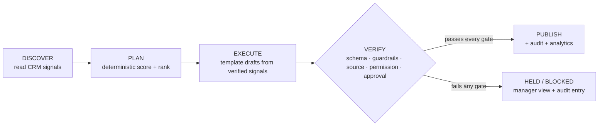
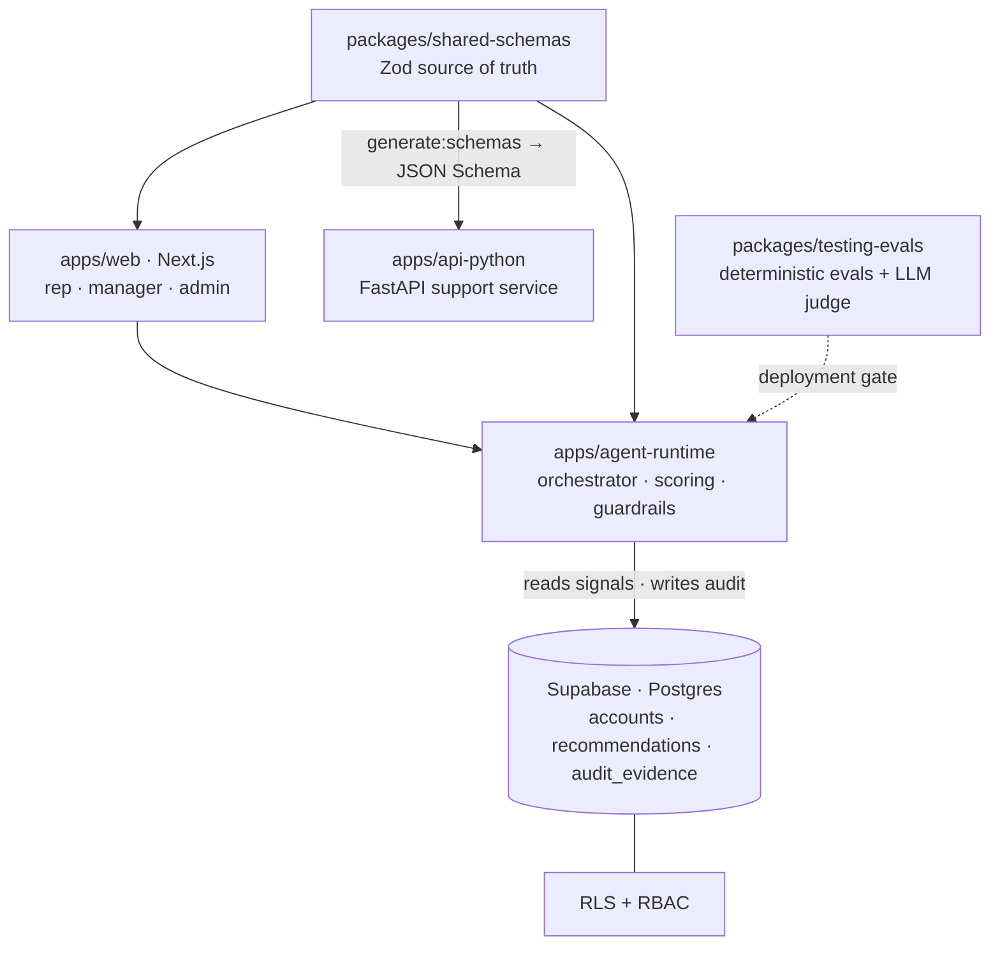

<div align="center">

# AI Account Prioritization Agent

**Turn CRM noise into a ranked daily action plan.** Every recommendation carries
its evidence, its reason codes, and proof that it passed every gate.

[](https://github.com/Lvvphole/ai-account-prioritization/actions/workflows/ci.yml)


</div>

> **The LLM never ranks accounts.** Deterministic scoring decides priority.
> Runtime guardrails are synchronous. The LLM judge runs only in evals. Nothing
> customer-facing sends without human approval.

---

## Overview

Reps burn selling hours deciding who to contact. Generic AI assistants invent
facts, cannot justify their output, and act without approval.

This is a daily agent that answers five questions with receipts.

| # | Question | Answer |
| - | -------- | ------ |
| 1 | Which account first? | A deterministic rank, reproducible across runs |
| 2 | Why does it matter? | Closed-set reason codes and a templated narrative |
| 3 | What should I do? | One concrete next best action |
| 4 | What backs it up? | Verified source signals traced to their source record |
| 5 | Is it safe to publish? | Pass or fail across schema, guardrail, source, and permission gates |

The design rests on one separation. A deterministic core makes every ranking and
safety decision. The LLM is confined to generation behind guardrails, and to
offline evaluation. Anything that fails a gate fails closed, surfaces in the
manager view, and writes an audit entry.

## Table of contents

- [Key features](#key-features)
- [How it works](#how-it-works)
- [Interface layers](#interface-layers)
- [Architecture](#architecture)
- [Tech stack](#tech-stack)
- [Getting started](#getting-started)
- [Configuration](#configuration)
- [Command reference](#command-reference)
- [Testing and evaluations](#testing-and-evaluations)
- [Data and security](#data-and-security)
- [Deployment](#deployment)
- [Project structure](#project-structure)
- [Status](#status)
- [Contributing](#contributing)
- [Docs](#docs)
- [License](#license)

## Key features

- **Deterministic ranking.** A pure weighted sum of account features with a
  stable tie-break. The same inputs produce an identical run.
- **Explainable by construction.** Closed-set reason codes plus a narrative
  templated from verified signals, so it cannot contain fabricated claims.
- **Traceable evidence.** The signal contract carries `kind`, `refId`,
  `description`, and `verified`. The web workspace joins those against a
  provenance map to show source system, source record, and observation time.
  That map is demo data today, and signals missing from it are flagged rather
  than filled in. Moving lineage into `SourceSignalSchema` is open work.
- **Honest measures.** Priority score, evidence confidence, and win probability
  are three different things. The UI keeps them separate and states that neither
  score nor confidence predicts a win.
- **Fail-closed gates.** Invalid schema, unverified evidence, unsupported claims,
  missing approval, or sub-floor confidence all block publication.
- **Human in the loop.** Customer-facing sends and CRM write-back require
  approval. The gate cannot be silently disabled.
- **Immutable audit.** Every critical action writes `audit_evidence`.
- **RBAC and Row Level Security.** Roles are enforced in Postgres, not just in
  the UI.
- **Eval-gated CI.** Deterministic evals for scoring, guardrails, security, and a
  golden run, plus an async judge that blocks deploys when enabled.
- **Schema as contract.** Zod is the single source of truth and generates the
  JSON Schema the Python service consumes.

## How it works

The runtime is one synchronous, deterministic loop. No model call lives inside
it.


```mermaid
flowchart LR
    A["DISCOVER<br/>read CRM signals"] --> B["PLAN<br/>deterministic score + rank"]
    B --> C["EXECUTE<br/>template drafts from verified signals"]
    C --> D{"VERIFY<br/>schema · guardrails · source · permission · approval"}
    D -- "passes every gate" --> E["PUBLISH<br/>+ audit + analytics"]
    D -- "fails any gate" --> F["HELD / BLOCKED<br/>manager view + audit entry"]
```

Two paths stay separate.

- **Runtime path**, synchronous and deterministic: orchestrator, Zod state
  validation, scoring, guardrails, permission and approval gate, audit, publish.
- **Evaluation path**, asynchronous and outside the runtime: deterministic evals
  plus an LLM judge. The judge degrades to a deterministic heuristic offline and
  becomes deploy-blocking when `EVAL_JUDGE_ENABLED=true`.

### Scoring

Six features are clamped to 0 to 1, scaled toward a saturation point, then
multiplied by their weight. Weights live in
`apps/agent-runtime/src/config/runtime.ts`.

| Feature | Weight | Scaling |
| ------- | ------ | ------- |
| Open pipeline | 25% | Linear to $250,000 |
| Verified intent | 20% | Linear to 3 signals |
| Contact staleness | 15% | Linear to 30 days |
| Account tier | 15% | Tier weight lookup |
| Lifecycle stage | 15% | Stage weight lookup |
| Health risk | 10% | (100 - health) / 100 |

Ranking is score descending with a stable `accountId` tie-break. Reason-code
thresholds are separate from the weights. High open pipeline applies at $50,000,
stale contact at 14 days, churn risk below health 40.

The score ranks attention needed, not close likelihood. Staleness and health risk
raise a score, so an at-risk renewal can outrank an active deal.

## Interface layers

Three layers, each with a different job.

**Data.** What the system ingests and verifies. Accounts, opportunities,
activities, intent, contracts, contacts, provenance, and outcomes.

**Customer workspace.** What a rep or manager needs to decide and act.

| Persona | Routes | What they get |
| ------- | ------ | ------------- |
| Rep | `/dashboard`, `/accounts/[id]` | Own ranked book with KPIs, evidence, drafted actions, CSV and JSON export |
| Manager | `/manager` | Exception queue, coverage by rep, revenue at risk against open pipeline, held items |
| Admin | `/admin` | Operations control plane |
| Anyone | `/`, `/login` | Landing page and role sign-in |

The account detail page follows the order a rep thinks in. Decision summary
first, then inspectable evidence, then the action workspace with a CRM
write-back preview, then surrounding context, then a correction path. Feedback
states what each reason changes before the rep commits to it.

**Admin control plane.** What an operator needs to configure, evaluate, and
troubleshoot. Ten sections behind a persistent header carrying the environment
badge, policy and prompt versions, last run, and health.

| Section | Purpose |
| ------- | ------- |
| `/admin` | Operational health, effectiveness, attention queue |
| `/admin/data` | Source health, freshness, rejects, lineage |
| `/admin/policy` | Deterministic scoring policy and safe change workflow |
| `/admin/drafting` | Model, prompt, schema, allowed actions, groundedness |
| `/admin/evals` | Deterministic suites, generative suites, experiments |
| `/admin/guardrails` | Holds, failed rules, approval rules |
| `/admin/runs` | Run history and the recommendation inspector |
| `/admin/users` | Capability matrix, teams, account access |
| `/admin/audit` | Append-only trail and incidents |
| `/admin/environments` | Versions per environment and the promotion path |

The scorer and the drafter have separate sections on purpose. They fail
differently, are measured differently, and roll back differently. A policy change
re-ranks every rep's day. A prompt change alters wording.

Policy is read-only by default. A change is drafted, simulated against
historical accounts, evaluated, and approved before it reaches production.

The pause controls model the intended split, where stopping customer-facing
sends is independent of stopping analysis. They are demo-only. `POST
/admin/controls` sets a browser cookie that the admin console reads back, and
nothing in the runtime or the send path consults it. Wiring them to shared
runtime state with durable audit evidence is open work.

## Architecture

A Turborepo monorepo using a co-located agent-module pattern.


```mermaid
flowchart TB
    W["apps/web · Next.js<br/>rep · manager · admin"]
    R["apps/agent-runtime<br/>orchestrator · scoring · guardrails"]
    S["packages/shared-schemas<br/>Zod source of truth"]
    P["apps/api-python<br/>FastAPI support service"]
    J["packages/testing-evals<br/>deterministic evals + LLM judge"]
    DB[("Supabase · Postgres<br/>accounts · recommendations · audit_evidence")]

    W --> R
    R -->|reads signals · writes audit| DB
    DB --- RLS["RLS + RBAC"]
    S -->|generate:schemas → JSON Schema| P
    S --> R
    S --> W
    J -. deployment gate .-> R
```

The Python service is a support service. It never ranks accounts, never controls
the runtime, and consumes generated JSON Schema only.

## Tech stack

| Layer | Technology |
| ----- | ---------- |
| Monorepo and tasks | Turborepo, pnpm workspaces |
| Runtime and schemas | TypeScript strict, Zod |
| Web | Next.js 15 App Router, React |
| Database and auth | Supabase Postgres, RLS, Auth |
| Support service | Python, FastAPI |
| Testing and evals | Vitest, LLM as a judge |
| Packaging and deploy | Docker Compose, Vercel |

## Getting started

### Prerequisites

- Node `>= 20` and pnpm `10.33`, pinned via `packageManager`
- Docker, optional, for the containerized stack
- Supabase CLI, optional, for local database work

The deterministic core runs with none of the optional integrations. Absent
credentials degrade to an in-memory store, so the loop is always runnable.

### Install and run

```bash
pnpm install
pnpm generate:schemas      # Zod to JSON Schema, also feeds the Python service
pnpm build
pnpm typecheck
pnpm test:evals

pnpm --filter agent-runtime dev    # a deterministic run end to end
pnpm --filter web dev              # the web app

EVAL_JUDGE_ENABLED=true pnpm test:judge
```

The web app runs without Supabase. In that mode `/login` offers one-click Rep,
Manager, and Admin entry. This is a demo convenience, not access control. Real
RBAC and RLS require `NEXT_PUBLIC_SUPABASE_URL` and
`NEXT_PUBLIC_SUPABASE_ANON_KEY`.

## Configuration

Copy `.env.example` to `.env` and fill in only what you need. Never commit real
secrets. The deterministic runtime requires none of these.

| Group | Variables | Purpose |
| ----- | --------- | ------- |
| Supabase | `NEXT_PUBLIC_SUPABASE_URL`, `NEXT_PUBLIC_SUPABASE_ANON_KEY`, `SUPABASE_URL`, `SUPABASE_ANON_KEY`, `SUPABASE_SERVICE_ROLE_KEY`, `SUPABASE_DB_URL` | Database, auth, RLS |
| Judge | `EVAL_JUDGE_ENABLED` (default `false`), `ANTHROPIC_API_KEY`, `EVAL_JUDGE_MODEL` | Async judge, eval only. Without a key it stays on the deterministic heuristic |
| CRM | `CRM_BASE_URL`, `CRM_API_KEY` | External source. Absent means in-memory mock |
| Approval | `REQUIRE_HUMAN_APPROVAL` (default `true`) | Hard safety switch |
| Observability | `SENTRY_DSN`, `SENTRY_TRACES_SAMPLE_RATE`, `LANGFUSE_PUBLIC_KEY`, `LANGFUSE_SECRET_KEY`, `LANGFUSE_BASEURL` | Sentry and Langfuse in the Python service, env-gated |

## Command reference

All commands run from the repo root.

| Command | Description |
| ------- | ----------- |
| `pnpm install` | Install workspace dependencies |
| `pnpm generate:schemas` | Generate JSON Schema from Zod |
| `pnpm build` | Build everything via Turborepo |
| `pnpm typecheck` | Typecheck all packages |
| `pnpm lint` | Lint all packages |
| `pnpm test` | Run unit tests |
| `pnpm test:evals` | Run deterministic eval gates |
| `pnpm test:judge` | Run the async judge eval |
| `pnpm build:api-python` | Build the Python support service |
| `pnpm supabase:types` | Regenerate Supabase types |
| `pnpm db:lint` | Lint Supabase migrations |
| `pnpm check:no-prisma` | Guard against Prisma |
| `pnpm scan:secrets` | Scan tracked files for secrets |
| `pnpm verify:security` | Verify the security package and runtime gate |
| `pnpm verify:observability` | Verify the PII-safe observability package |
| `pnpm verify:production` | Run every gate and write a report |
| `pnpm docker:config` | Validate the Compose file |
| `pnpm docker:build` | Build all images |
| `pnpm dev` | Run dev tasks |
| `pnpm clean` | Clean build artifacts |

## Testing and evaluations

Deterministic evals live in `packages/testing-evals` and cover scoring,
guardrails, adversarial security, and a golden run proving the orchestrator is
reproducible.

Four security properties are asserted. Prompt injection cannot change rank.
Fabricated claims never publish. Unverified evidence fails closed. Customer-facing
actions require approval.

The judge runs only via `pnpm test:judge`. It stays out of the runtime path and
becomes deploy-blocking when `EVAL_JUDGE_ENABLED=true`.

```bash
pnpm test:evals
EVAL_JUDGE_ENABLED=true pnpm test:judge
```

## Data and security

Persistence, auth, and access control live in Supabase, defined by versioned
migrations in `supabase/`.

| Migration | Contents |
| --------- | -------- |
| `0001_init_core_tables` | Extensions, enums, `set_updated_at` helper |
| `0002_auth_rbac_profiles` | Profiles and RBAC roles |
| `0003_accounts_contacts_opportunities` | CRM domain tables and activities |
| `0004_recommendations_audit_evidence` | Recommendations, audit, eval results |
| `0005_rls_policies` | Row Level Security for every scoped table |
| `0006_observability_events` | Observability event sink |

- **RBAC and RLS.** Reps see only their accounts. Managers and admins are scoped
  by policy. Service-role access is confined to trusted server contexts.
- **Immutable audit.** `audit_evidence` records critical actions, meaning
  publishes, blocks, and CRM writes. Writes go through the service role, and the
  table has no client insert path.
- **Approval gates.** Customer-facing sends and CRM write-back fail closed
  without explicit approval.
- **Export safety.** CSV cells beginning with a formula character are neutralized
  before quoting, so CRM-sourced names cannot execute in a spreadsheet.
- **No secrets in the repo.** `.env.example` and `supabase/seed.sql` hold local
  placeholders only.

## Deployment

- **Containers.** `infra/compose.yaml` builds three images. Validate with
  `pnpm docker:config`, then build with `pnpm docker:build`.
- **Web.** Deploy `apps/web` on Vercel with Root Directory set to `apps/web`.
- **Database.** Apply `supabase/migrations`, then seed locally with
  `supabase/seed.sql`.
- **CI/CD.** GitHub Actions: `ci.yml`, `evals.yml`, `deploy.yml`, and
  `security.yml`.

## Project structure

```
apps/
  agent-runtime/   Deterministic orchestrator, scoring, guardrails
  web/             Next.js UI: landing, sign-in, rep, manager, admin control plane
  api-python/      FastAPI support service
packages/
  shared-schemas/  Zod source of truth and JSON Schema generation
  supabase-client/ Typed Supabase clients and generated DB types
  security/        RBAC, approval, PII redaction
  observability/   PII-safe event layer
  testing-evals/   Deterministic evals and the async judge
  config-*/        Shared TypeScript and ESLint config
infra/             Docker Compose and per-service Dockerfiles
supabase/          Migrations, RLS policies, seed, config
scripts/           Build and verification helpers
docs/              PRD, ARCHITECTURE, CONTEXT
.github/workflows/ ci.yml, evals.yml, deploy.yml, security.yml
```

## Status

Shipped: the deterministic runtime, the Zod schema contract, deterministic evals
and the async judge, Supabase with RLS and immutable audit, the security and
observability packages, the Docker stack, and the CI/CD and security workflows.

The web app covers all three interface layers. Reps get a scoped book with
evidence provenance, drafted email, call, and meeting actions, and exports.
Managers get an exception queue and a revenue split. Admins get the ten-section
control plane with working pause controls and a run inspector.

Remaining work is operational. Provision Supabase, Sentry, and Langfuse. Wire
the control plane to live telemetry, since its counters are sample data. Wire
the pause controls to shared runtime state, since today they only affect the
console. Move signal lineage into the shared schema so provenance travels with
the contract instead of a web-side map.

## Contributing

Read [`AGENTS.md`](./AGENTS.md) first. It is the operating contract.

Definition of Done:

```bash
pnpm install
pnpm generate:schemas
pnpm build
pnpm typecheck
pnpm test:evals
```

Full production verification, writing a report under `verification-reports/`:

```bash
pnpm verify:production
```

The executor never self-certifies. The verifier owns completion. Never push
directly to `main`. Open a PR.

## Docs

- [`AGENTS.md`](./AGENTS.md), the operating contract, read first
- [`docs/PRD.md`](./docs/PRD.md), product requirements
- [`docs/ARCHITECTURE.md`](./docs/ARCHITECTURE.md), system design
- [`docs/CONTEXT.md`](./docs/CONTEXT.md), process

## License

MIT. See `package.json`.
